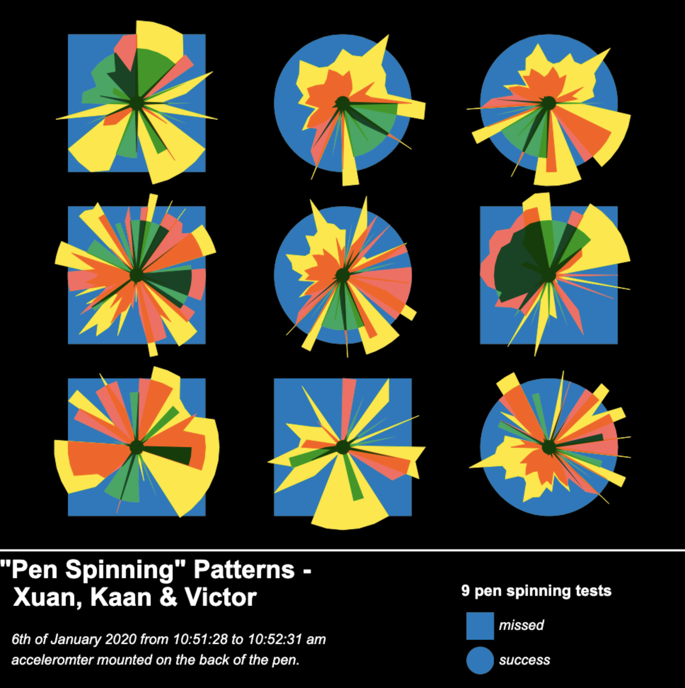
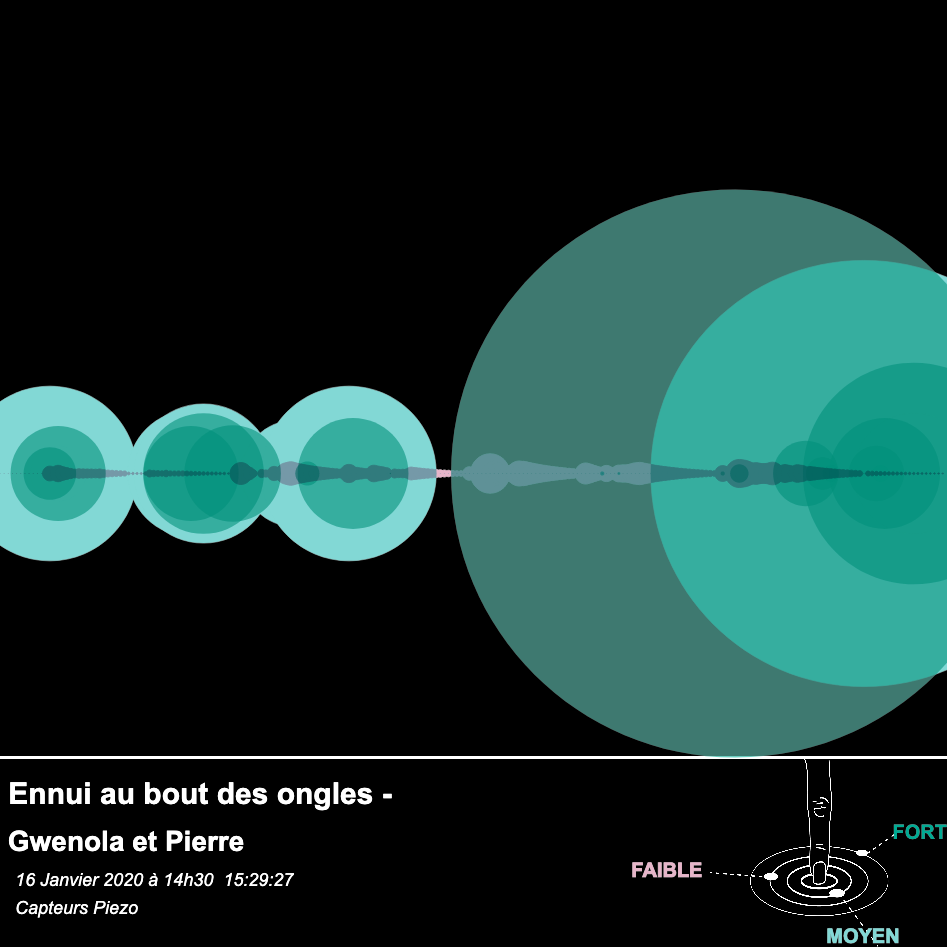

# Les gestes de l'ennui

The goal of this project is to experiment with data visualisation from recording data with [arduino](https://www.arduino.cc/) to exporting it via [p5.riso](https://antiboredom.github.io/p5.riso/)  for printing.

L'objectif de ce projet est un travail sur la représentation de données : de la captation et l'impression.

Le sujet d'étude se portera sur la capatation de gestes du quotidien s'inscrivant dans une temporalité fugace porteur de la marque de l'ennui, afin de les enregistrer et les représenter dans le but de les péréniser via le processus de print.

Les données vont être captées à l'aide de circuits électroniques réalisés via [arduino](https://www.arduino.cc/) , les données seront ensuite enregistrées et mises en forme à l'aide de [processing](https://processing.org/), puis interprétées et mises en image par l'intermédiaire de [p5js](https://p5js.org/) et de la bibliothèque [p5.riso](https://antiboredom.github.io/p5.riso/) dédiée à la préparation d'image pour l'impression par risographie.

Le support de cours technique est disponible à cette [adresse](https://github.com/b2renger/p5js_gestes_de_l_ennui/readme.md)

Le code des projets est disponible à cette [adresse](https://github.com/AtelierNum/projet_gestes_de_l_ennui_1920)

# Pen Spining patterns 

réalisé par : Victor Cornier, Xuan Meng et Nicolas Kaan.

[Cliquez ici pour voir la page](https://ateliernum.github.io/projet_gestes_de_l_ennui_1920/CORNIER_VICTOR_KAAN_NICOLAS/Code/index.html)

# Tête Lourde 

réalisé par : Camille Petitbon et Carla Isaia-Chaigne

[Cliquez ici pour voir la page](https://ateliernum.github.io/projet_gestes_de_l_ennui_1920/PETITBON_CAMILLE_CARLA_ISAIA-CHAIGNE/Code/index.html)

# Boring Scrolling Phoning patterns 

réalisé par : Tibère Guerin et Rouajan Martin

[Cliquez ici pour voir la page](https://ateliernum.github.io/projet_gestes_de_l_ennui_1920/GUERIN_TIBERE_ROUAJAN_MARTIN/Code/index.html)

# La guerre des boutons

réalisé par : Yachun Jiang et Lisa Venzia

[Cliquez ici pour voir la page](https://ateliernum.github.io/projet_gestes_de_l_ennui_1920/JIANG_YACHUN_VENEZIA_LISA/Code/index.html)

# Ennui au bout des ongles

réalisé par : Pierre Jarry et Gwenola Rousselot

[Cliquez ici pour voir la page](https://ateliernum.github.io/projet_gestes_de_l_ennui_1920/JARRY_PIERRE_ROUSSELOT_GWENOLA/Code/index.html)

# Kicking your foot

réalisé par : Myriam Girard et Chloé Patrigeon

[Cliquez ici pour voir la page](https://ateliernum.github.io/projet_gestes_de_l_ennui_1920/GIRARD_MYRIAM_PATRIGEON_CHLOE/Code/index.html)

# "Tortillons" patterns

réalisé par : Romane Lombard et Morgane Mézard

[Cliquez ici pour voir la page](https://ateliernum.github.io/projet_gestes_de_l_ennui_1920/LOMBARD_ROMANE_MEZARD_MORGANE/Code/index.html)

# Positive energy

réalisé par : Inés Al Oumamai et Émeline Rolland

[Cliquez ici pour voir la page](https://ateliernum.github.io/projet_gestes_de_l_ennui_1920/AL_OUMAMI_INES_ROLLAND_EMELINE/Code/index.html)

# Click patterns

réalisé par : Andréan Cadieu et Stanislas Sérot

[Cliquez ici pour voir la page](https://ateliernum.github.io/projet_gestes_de_l_ennui_1920/CADIEU_ANDREANE_SEROT_STANISLAS/Code/index.html)

# "Lazy Boy" patterns 

réalisé par : Pierre Tellier et Ingrid Coulmeau Corallo

[Cliquez ici pour voir la page](https://ateliernum.github.io/projet_gestes_de_l_ennui_1920/TELLIER_PIERRE_INGRID_COULMEAU_CORALLO/Code/index.html)

# "Hhhhh" Moment

réalisé par : Julie Legal et Élodie Richard

[Cliquez ici pour voir la page](https://ateliernum.github.io/projet_gestes_de_l_ennui_1920/LEGAL_JULIE_RICHARD_ELODIE/Code/index.html)

# "Scroll" Patterns

réalisé par : Youssra Haimani et Flore Orillard

[Cliquez ici pour voir la page](https://ateliernum.github.io/projet_gestes_de_l_ennui_1920/HAIMANI_YOUSSRA_ORILLARD_FLORE/Code/index.html)

# Boring Voice patterns 

réalisé par : Vincent Harter et Ludivine Audren

[Cliquez ici pour voir la page](https://ateliernum.github.io/projet_gestes_de_l_ennui_1920/HARTER_VINCENT_LUDIVINE_AUDREN/Code/index.html)

# Can't stop scrolling

réalisé par : Baptiste Decrion et Xuan Meng

[Cliquez ici pour voir la page](https://ateliernum.github.io/projet_gestes_de_l_ennui_1920/DECRION_BERTRAND_MENG_XUANN/Code/index.html)

